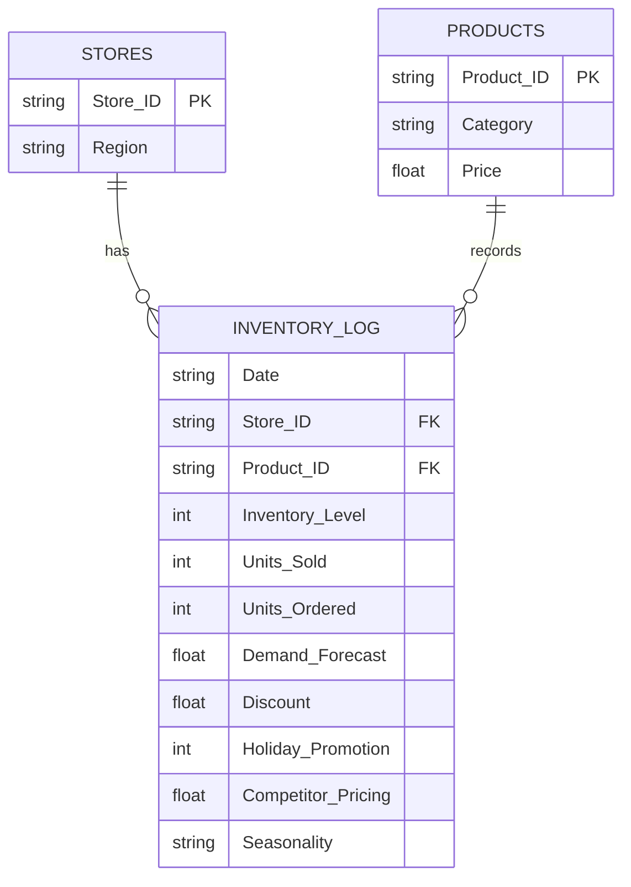

#  SQL-Driven Inventory Optimization for Retail

##  Project Overview
Urban Retail Co. is a rapidly expanding mid-sized retail chain struggling with reactive inventory management. Frequent stockouts of fast-moving products and overstocking of slow-moving items were locking up working capital and damaging customer experience. 

The objective of this project was to engineer an end-to-end SQL data pipeline to transform a raw, flat dataset of over 100,000 transactions into a normalized relational database, and develop actionable KPI dashboards to optimize reorder thresholds and supply chain visibility.

**Tech Stack:** Python (Pandas, Matplotlib, Seaborn), SQLite, Advanced SQL (CTEs, Window Functions, Data Aggregation)

---

##  Database Architecture (3NF Normalization)
The raw data was ingested, cleaned, and normalized into a 3rd Normal Form (3NF) relational schema to eliminate redundancy and optimize query performance. Indexes were applied to primary and foreign keys.

## 📊 KPI Dashboards & Visualizations

### 1. The Cost of Stockouts & ABC Classification
Quantified the financial impact of current inefficiencies and implemented a Pareto-based classification model using SQL `PERCENT_RANK()` to group SKUs by revenue impact.

### 2. Critical Stockout Risk (Days of Supply)
Calculated the exact days of supply on hand for high-velocity items.

### 3. Supplier Performance & Supply Gap
Visualized the procurement inefficiency by mapping the net variance between units ordered and units sold.

### 4. Demand Fulfillment & Seasonality
Mapped actual sales against forecasted demand to identify stockout-driven revenue caps.

### 5. Product Velocity (Fast vs. Slow Movers)
Visualized the extremes of inventory movement to identify our highest and lowest performing SKUs, highlighting where capital is moving and where it is trapped.

---

## 💡 Key Analytical Insights
1. **Critical Supply Deficits:** Analysis of inventory ratios reveals that high-velocity categories (Electronics, Toys) are operating on dangerously thin margins, averaging only **1.5 to 1.6 days of supply** on hand.
2. **Purchasing Misalignment:** Supply gap analysis highlights a systemic issue where units sold consistently outpace units ordered (yielding negative supply variances). The supply chain is actively draining safety stock rather than replenishing at the rate of consumer demand.
3. **Stockout-Driven Forecast Variances:** Seasonal data indicates a persistent negative forecast error. Correlated with the critically low days of supply, this indicates that the forecasting model is likely accurate, but actualized sales are being artificially suppressed by inventory stockouts.

## 🚀 Strategic Recommendations
* **Automate Reorder Triggers:** Bridge the negative supply variance by aligning procurement orders directly with the 7-day trailing velocity, ensuring units ordered meet or exceed units sold. Implement automated alerts tied to our SQL `Est_Reorder_Point` logic.
* **Capital Reallocation (ABC Strategy):** Aggressively reallocate safety stock capital from C-Class items (bottom 50% revenue drivers) to ensure A-Class items (top 20%) never hit the 1.5-day critical supply threshold.
* **Protect Seasonal Peaks:** Winter periods with active promotions yield the highest average sales velocity. Baseline safety stock must be front-loaded ahead of Q4 to prevent stockouts from capping revenue.

