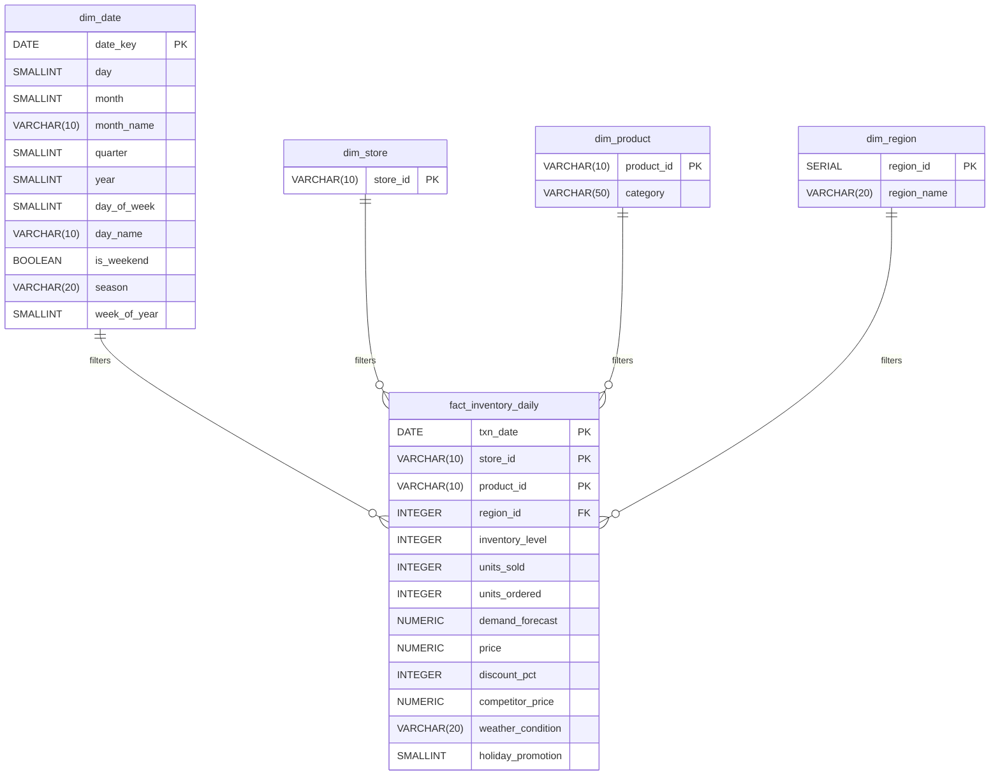

# SQL-Driven Inventory Optimization for Retail

## Project Overview
Urban Retail Co. is a rapidly expanding mid-sized retail chain struggling with reactive inventory management. Frequent stockouts of fast-moving products and overstocking of slow-moving items were locking up working capital and damaging customer experience. 

The objective of this project was to engineer an end-to-end data pipeline, moving from initial local prototyping to a production-ready data warehouse that powers automated KPI dashboards.

**Tech Stack:** Python (Pandas, Matplotlib), SQLite (Prototyping), PostgreSQL (Production Backend), Data Architecture (Star Schema)

---

##  Phase 1: Local Prototyping & EDA (Python + SQLite)
Before building the production backend, I utilized SQLite and Python within a Jupyter Notebook for rapid exploratory data analysis (EDA). This lightweight sandbox allowed me to query the 100,000+ row dataset and quickly prove the core business hypothesis.

**Key Prototyping Findings:**
* **The 1.5-Day Survival Buffer:** Uncovered that high-velocity categories (Electronics, Toys) were operating on dangerously thin margins, averaging only 1.5 to 1.6 days of supply on hand.
* **The "Fake" Forecast Error:** Correlated critical stockouts with seasonal demand, proving the underlying forecasting model was actually accurate, but sales were being artificially suppressed by hard inventory limits.

 **[View the Phase 1 Python Notebook and EDA Visualizations here](/exploratory_data_analysis/inventoryanalysis.ipynb)**

---

## Phase 2: Production Architecture & BI (PostgreSQL)
Once the business logic was proven locally, the pipeline was migrated to a PostgreSQL 14+ backend to support at-scale analytical processing (OLAP). The data was modeled into a highly efficient **Star Schema**, leveraging advanced window functions and aggregations to automate dynamic safety stock calculations.

### Database Architecture

## Executive KPI Dashboard
The PostgreSQL backend directly feeds this automated reporting dashboard, providing a unified view of supply chain health and actionable reorder triggers:

## Strategic Recommendations
Automate Reorder Triggers: Bridge the negative supply variance by aligning procurement orders directly with the 7-day trailing velocity, ensuring units ordered meet or exceed units sold. Implement automated alerts tied to our SQL Est_Reorder_Point logic.

Capital Reallocation (ABC Strategy): Aggressively reallocate safety stock capital from C-Class items (bottom 50% revenue drivers) to ensure A-Class items (top 20%) never hit the 1.5-day critical supply threshold.

Protect Seasonal Peaks: Winter periods with active promotions yield the highest average sales velocity. Baseline safety stock must be front-loaded ahead of Q4 to prevent stockouts from capping revenue.
